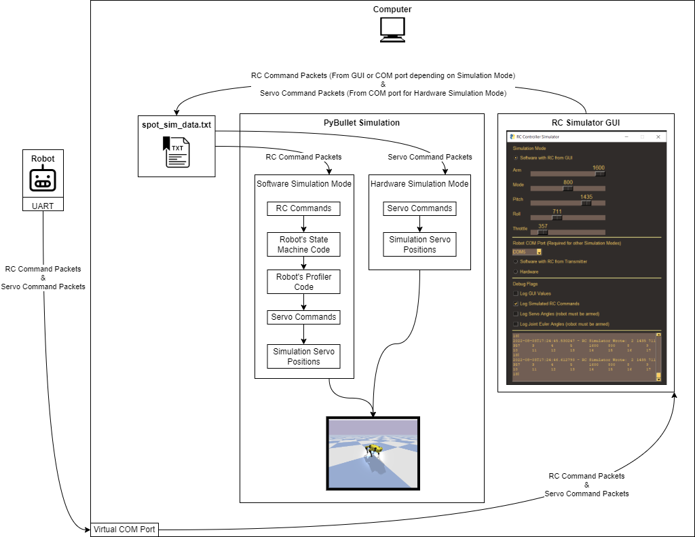

# SpotMicro

<figure class="video_container">
  <iframe src="https://www.youtube.com/embed/MX95Jb588po" frameborder="0" allowfullscreen="true"> </iframe>
</figure>

SpotMicro is a 3D model that I found on [Thingiverse](https://www.thingiverse.com/thing:3445283). I was interested in
the model not only because it looks good but because it also presents some fun robotics challenges.

## Hardware

I outfitted the robot with a set of electronics similar to those listed on
the [SpotMicroAI](https://spotmicroai.readthedocs.io/en/latest/gettingStarted/#electronics) site. Regrettably, I printed
the model in PETG which made gluing components together very difficult. Many of the parts were modified using
PrusaSlicer or mechanically, after printing, to make the servos fit.

| Quantity | Item                                                   |
|----------|--------------------------------------------------------|
| 12       | DS3235-180 Degree Coreless Servo 35kg                  |
| 1        | MicroPython PyBoard v1.1                               |
| 1        | MPU-6050 6 DOF 3 Axis Gyroscope + Accelerometer Module |
| 1        | I2C 16x2 LCD Module                                    |
| 1        | 16 Channel PCA9685 I2C-Servo Driver                    |
| 1        | YPG 20A HV SBEC / XL4015 DC-DC Step Down               |
| 1        | FrSky x4R SBUS RC Receiver                             |
| 1        | 3S 40A BMS For 18650 Lithium Battery                   |
| 3        | Sony Murata VTC5A 18650 2600mAh 25A Battery            |

## Software

### Architecture

#### Main Loop

Every 19.65 milliseconds...

1. The LiFePO4 battery is sampled via an ADC on the PyBoard, after passing through a voltage divider.
2. The LCD screen is updated with the battery voltage and when the last main loop occurred.
3. RC commands are read in via the SBUS UART.
4. The State Machine is updated.
    1. The State Machine will not output servo command until it is armed via RC input.
    2. Once armed the State Machine monitors the Profiler and uses RC input to add new position targets. Position
       targets are provided to the Profiler as cartesian coordinates (x, y, z) that define where the tip of each leg
       should be.
5. New servo commands from the Profiler are sent to the servos by updating the PCA9685 via I2C.
    1. The Profiler is responsible for inverse kinematics and ensuring that motion is smooth.
6. RC Command and Servo Command packets are sent to the UART for debug and simulation purposes.

### UART

This is a definition of the types of packets that are sent out of the robot's UART.

All packets start with ``\x02`` (STX) and end with the sequence ``\x03\r\n`` (ETX, carriage return, line feed).

Values inside packets are delimited by `\t` (TAB). The **first** value indicates the packet type which are defined
below. The **final** value is the time that the last loop finished, in microseconds. Since the packet is generated as
part of the control loop, this time is useful for debug.

#### RC Command Packet

RC Command Packets have a code of `2`. Each value indicates the command associated with one of the RC channels.

    2	980	980	980	3	4	5	500	499	8	9	10	11	12	13	14	15	16	17	18	123456

#### Servo Command Packet

Servo Command Packets have a code of `3`. The first 12 values indicate the angle in degrees that will be commanded to
one of the 12 servos. The next value indicates the current State Machine state. The next value indicates how many
position targets are queued up.

    3	515	1	-54	-54	140	140	51	51	-54	-54	140	140	4	0	123456

**Note:** The code typically orders the 12 servos as follows. When viewed in the following format leg components are
grouped together.

    front_right_shoulder, front_left_shoulder,
    front_right_leg, front_left_leg,
    front_right_foot, front_left_foot,
    rear_right_shoulder, rear_left_shoulder,
    rear_right_leg, rear_left_leg,
    rear_right_foot, rear_left_foot,

### Simulation Virtual Environment Setup

The simulator depends on models from a repo which will be checked out using the following commands. Once this is done,
**remove** the xml tree at `<link name="lidar_link">` and at `<joint name="base_lidar" type="fixed">` from 
`urdf\spotmicroai_gen.urdf.xml` to get a robot model that does not have the lidar backpack.

    git clone https://gitlab.com/custom_robots/spotmicro/nvidia-jetson-nano.git
    cd nvidia-jetson-nano
    git checkout 108060ee1e182b1e928ee04db1a5c739a9209621
    cd ..

This project features both software and hardware in the loop simulators. The simulation environment can be setup using
the following commands. Python 3.7.8 32 bit was used for development.

    cd spot_sim
    pipenv install --deploy
    pipenv run python spot_sim.py
    cd ..

### Software Simulation

#### Software Simulation With RC Input Via GUI

In this mode, the RC Simulator GUI application writes RC packets to `spot_sim_data.txt`. These packets are consumed by
the simulation environment to control the robot. This is the default mode of operation so no additional setup or
hardware is required.

#### Software Simulation With RC Input Via Transmitter

In this mode of operation, a physical RC transmitter feeds RC commands to the RC receiver on the robot. This is
accomplished fairly simply since the robot writes RC Command Packets out to a UART.

### Hardware Simulation

In this mode of operation, a physical RC transmitter feeds RC commands to the RC receiver on the robot and the robot
decides how to actuate the servos. This is accomplished fairly simply since the robot writes Servo Command Packets out
to a UART.

### Upload

The `micropython/pyboard.py` and `micropython\upload.py` scripts work together to enable a more streamlined development
flow when working with the PyBoard. The script diffs source files and only updates those that are out of date. The
script can be used as follows where `<COM>` is the COM port associated with the robot's UART.

    cd spot_sim
    pipenv run upload.py <COM>
    cd ..

## Future Work

* Adjust the window read timeout in `rc_sim.py` to allow the COM port to be copied over to `spot_sim_data.txt` more
  frequently. This should be done after testing with hardware in loop simulation, since the servo commands need to be
  updated rapidly.
* Remove debug flags from micropython directory. They should no longer be necessary since the kinematics demo was
  removed from the Software Simulation.
* Test upload script now that it no longer reads from the COM port after upload. This functionality is now provided by 
  the RC Simulator GUI application.